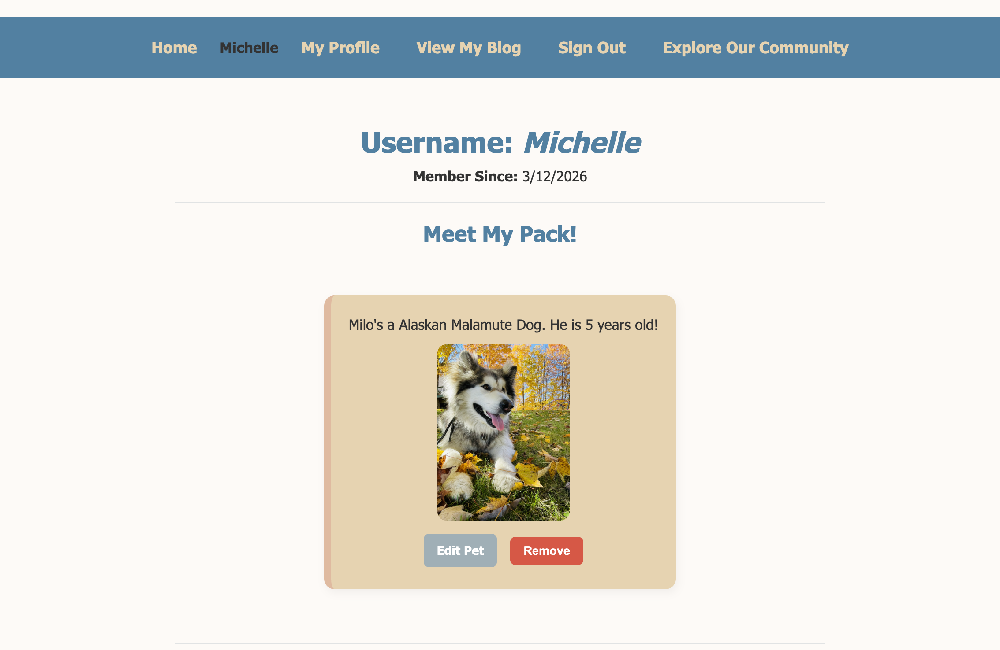
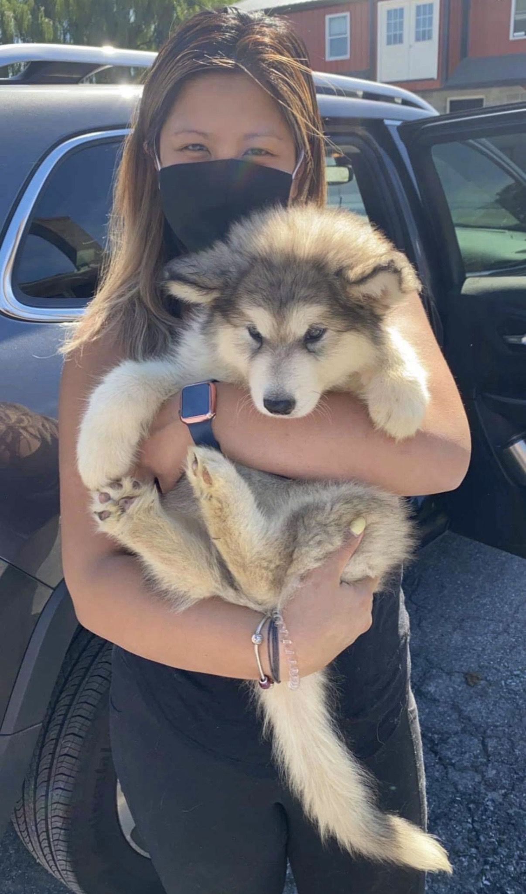

# Pawrent Chronicles

## Background

I've always loved dogs and dreamed of becoming a Pawrent one day. Growing up with five sisters though, my parents were always against the idea. Still, I held on to the hope that one day, it will happen for me.

As life went on- college, starting my career- it never seemed like the right time. Something always got in the way and it just stayed in the back of my mind. 

Then COVID happened. The world slowed down, everything shut down, and for the first time, it finally felt like the right moment.

On September 5, 2020, I went to pick up my fur baby- and my life changed forever!

Raising Milo has been one of the most fulfilling experiences of my life. He's brought me a kind of joy and happiness I never could've imagined. He isn't just my dog- he's my family, my everyday and the most special piece of my heart. 

Of course as a first-time Pawrent, there were so many questions and uncertainties along the way. There were moments of doubt, moments where I wondered if I was doing the right thing- but somehow, we figured it out.

What really surprised me was how much Milo would change my world beyond the two of us. Because of Milo, I have met some of my closest friends to this day. It started with a simple smile, or "Hello", passing each other on a walk or meeting at the dog park. We bonded over our shared love for our fur babies, and those connections have meant so much to me.

>That's what inspired me to create ***Pawrent Chronicles***. 

I wanted to create a space for people like us- for dog lovers, current Pawrents and anyone thinking about bringing a pup into their life. A place where we can ask questions _(even the ones that feel silly)_, connect with others going through the same experiences, and learn from what's worked for each other's pups. A space to share joyful moments and stories that can brighten someone's day.

But more than anything, I want this to be a place where people feel understood.

Because raising a dog or a cat is emotional. At times it can be overwhelming and __hard__ but it is also rewarding and ___beautiful___. They give us unconditional love and support. And having people who _get it_, who have been through it and are going through it makes all the difference.

The amazing thing is that, thanks to social media and the internet, we don't have to rely on chance to meet at a dog park or live in the same area to find that connection. 

My hope is that this blog can help build that same sense of community and support that meant so much to me while raising Milo. Because there's truly nothing like being surrounded by people who understand and share the love you have for your fur baby.

## Getting Started

### Planning Materials: 

[Trello Board](https://trello.com/b/ULoF7nuY)

[Deployed Application](https://pawrent-chronicles-55db5bf8619e.herokuapp.com/users/me)

## Attributions

[MDN for using :root for CSS](https://developer.mozilla.org/en-US/docs/Web/CSS/Reference/Selectors/:root)

[NPM for Cloudinary](https://www.npmjs.com/package/cloudinary)

[NPM for Multer](https://www.npmjs.com/package/multer)

[Coolors for Color Scheme for Blog](https://coolors.co/)

[CSS Tricks](https://css-tricks.com/almanac/properties/)

[Stock Photo of a Dog and Cat](https://www.freepik.com/free-ai-image/adorable-portrait-pets-surrounded-by-flowers_358126863.htm#fromView=keyword&page=1&position=1&uuid=9109d22c-e747-43aa-8185-7dda4fe6cd47&query=Happy+dog+cat)

## Technologies Used

* JavaScript
* EJS
* Express.js
* Node.js
* HTML
* CSS
* Morgan
* Method-Override
* Dotenv
* MongoDB
* Connect-Mongo
* Express-Session
* Cloudinary
* MVC
* RESTful Routing

## Next Steps

While Working on the App I wanted to add more things to make the app more user friendly and appealing. However, due to timing I was not able to look into adding some other features

1. Allow users to upload profile photo.

2. Add photo upload options to posts.

3. Allow users to filter blog posts/profiles.
	* Filter by user
	* Filter by post content
	* Filter by post date
	* Filter by dog breeds

4.	How to set user roles for additional functions; ie. ensure community members are following community guidelines.
	* Set Administrators
	* Set Moderators

5.	Allow people to make threads
	* Allow people to comment on other people's comments to create a thread 

6.	Allow to follow other Pawrent Profiles

7.	Allow community members to privately message each other.
	* Allow to set if they want this feature or not

8.	Set a geographic location
	* Allow pawrents to meet up with their fur babies

9.	Add more features for pets
	* Add temperament
	* Add photo gallery?
	* Add their social media pages

10. Allow Pawrents to select if interested in meet ups
